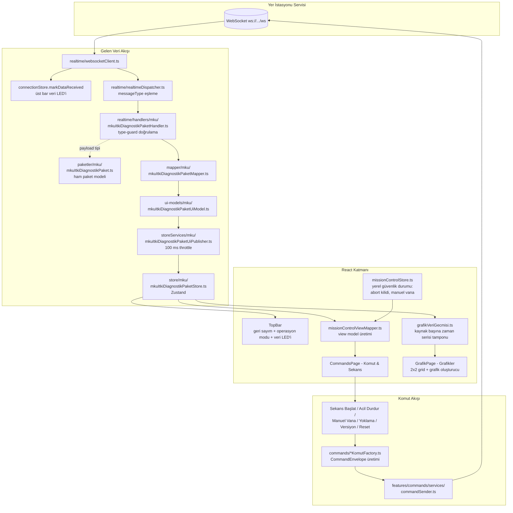

# Rocket Web UI

Rocket Web UI, roket yer istasyonu sistemi için geliştirilen React + TypeScript tabanlı web arayüzüdür.

Bu arayüz WebSocket üzerinden gerçek zamanlı JSON mesajları alır, mesajları `messageType` değerine göre ilgili handler'a yönlendirir, payload verisini uygun paket modeline ayırır, UI modeline dönüştürür ve dashboard/komut & sekans/tablolar/debug ekranlarında gösterir.

Arayüz ayrıca WebSocket üzerinden servise komut mesajları gönderebilir.

## Amaç

Bu projenin amacı:

- Roketten gelen telemetri verilerini gerçek zamanlı göstermek
- WebSocket üzerinden gelen JSON mesajlarını işlemek
- Mesaj tipine göre payload deserialize etmek
- Büyük mesaj modellerini sade UI modellerine dönüştürmek
- Komutları WebSocket üzerinden servise göndermek
- Komutlarda UI üzerinden girilen değerleri payload olarak göndermek
- Geliştirme sırasında ham JSON mesajlarını debug ekranında göstermek
- Modüler, geliştirilebilir ve bakımı kolay bir web arayüzü oluşturmak

## Teknolojiler

- React
- TypeScript
- Vite
- WebSocket
- Zustand
- React Router
- Three.js (ana sayfa 3D roket sahnesi)
- OpenCascade WASM / `occt-import-js` (`.stp` ve `.step` CAD modeli desteği)
- Leaflet (offline konum haritası)
- WebCodecs (`VideoDecoder`) — S-band canlı video çözme

## Mimari Kurallar

- Servisler gerçek mesaj modelini yayınlar.
- Web UI kendi UI modelini üretir.
- UI modeller servis tarafına taşınmaz.
- React component içinde WebSocket parse işlemi yapılmaz.
- React component içinde doğrudan mesaj mapping yapılmaz.
- Gelen mesajlar önce `RealtimeMessageEnvelope` olarak parse edilir.
- Mesajlar `messageType` değerine göre dispatcher/handler yapısı ile işlenir.
- Handler'lar payload'u type-guard ile doğrular, mapper ile UI modeline çevirir ve publisher'a verir.
- Publisher'lar store güncellemelerini sabit aralıklarla (throttle) yayınlar; her mesajda render tetiklenmez.
- Komutlar `CommandEnvelope` ile gönderilir.
- Komutlarda `messageType`, komutun ait olduğu paket/model tipini belirtir.
- Komutlarda `commandType`, ilgili paket/model içindeki komutu belirtir.
- Payload isteyen komutlarda değerler UI inputlarından alınır ve payload içerisine yazılır.
- Anlamlı her mimari/özellik değişikliğinde `README.md` güncellenir.

## Veri ve Komut Akış Şeması



## Gelen Mesaj Formatı

Servisten WebSocket üzerinden gelen mesaj formatı:

```json
{
  "id": "1",
  "messageType": "MKUItkiDiagnostikPaket",
  "payload": {}
}
```

TypeScript karşılığı:

```ts
export type RealtimeMessageEnvelope<TPayload = unknown> = {
  id: string;
  messageType: string;
  payload: TPayload;
};
```

Bu yapıda:

- `id`: mesajın geldiği işlemci/route/servis kimliğidir.
- `messageType`: payload modelinin adıdır (`contracts/messageTypes.ts`).
- `payload`: ilgili paket modelinin JSON karşılığıdır.

Tanımlı mesaj tipleri:

```ts
export const MessageTypes = {
  MKUItkiDiagnostikPaket: "MKUItkiDiagnostikPaket",
  MKUYoklamaPaket: "MKUYoklamaPaket",
  MKUVersiyonPaket: "MKUVersiyonPaket",
  MKUResetPaket: "MKUResetPaket",
  MKUKomutPaket: "MKUKomutPaket",
  MKUSekansGonderPaket: "MKUSekansGonderPaket",
  MKUSekansAlPaket: "MKUSekansAlPaket",
  MKUSekansEepromYazPaket: "MKUSekansEepromYazPaket",
  MKUSekansEepromOkuPaket: "MKUSekansEepromOkuPaket",
  MKUItkiKomutaPaket: "MKUItkiKomutaPaket",
  MKUEepromPaket: "MKUEepromPaket",
} as const;
```

### Yeni Alan: `batarya_yuzde`

`MKUItkiDiagnostikPaket` içine batarya doluluk yüzdesi (0-100) eklendi:

```json
{ "messageType": "MKUItkiDiagnostikPaket", "payload": { "batarya_yuzde": 87.4 } }
```

Alan **opsiyoneldir**: servis tarafı göndermeye başlayana kadar paketlerin
düşmemesi için doğrulamada `isOpsiyonelSayisalAlan` kullanılır. Alan yayına
girdiğinde paket tipindeki `?` kaldırılıp doğrulama `isSayisalAlan`'a çevrilerek
zorunlu hale getirilebilir. Diğer sayısal alanlar gibi `null`/`NaN` gelebilir;
bu durumda üst bardaki gösterge `--%` ve gri gösterir.

### Sayısal Alanlarda `null` / `NaN`

Servis, sözleşmede sayısal olan bir alanı sensör okunamadığında ya da hesap
tanımsız kaldığında `null` veya `NaN` olarak gönderebiliyor. Bu yüzden gelen
paket tiplerinde sayısal alanlar `SayisalAlan` (`number | null`) olarak
tanımlıdır ve doğrulama iki katmana ayrılmıştır:

| Gelen değer          | Doğrulama       | UI modeldeki karşılığı |
| -------------------- | --------------- | ---------------------- |
| sonlu sayı           | geçerli         | değerin kendisi        |
| `null` / `NaN`       | geçerli         | `undefined` (veri yok) |
| `Infinity`           | geçerli         | `undefined` (veri yok) |
| alan hiç yok, string | **geçersiz**    | paket düşürülür        |

Kural: **tek bir alanın okunamaması paketin tamamını düşürmez.** Sadece o alan
"veri yok" olur, paketin geri kalanı UI'a akmaya devam eder. Alanın hiç
gelmemesi veya sayısal olmayan bir tip gelmesi ise sözleşme uyuşmazlığı
sayılır; paket `console.warn` ile loglanır ve düşürülür.

Ortak yardımcılar `src/shared/utils/sayisalDogrulama.ts` içindedir:

```ts
isSayisalAlan(deger); // handler doğrulaması: null/NaN kabul, eksik alan ret
isSayisalAlanDizisi(deger, uzunluk); // sabit uzunluklu sayısal dizi alanı
isSayisal(deger); // kullanılabilir (sonlu) değer mi?
sayisalDeger(deger); // mapper: okunamayan değer -> undefined
sayisalDegerDizisi(degerler); // mapper: dizi alanı -> (number | undefined)[]
```

Bu nedenle UI modellerinde sayısal alanlar `number | undefined` tipindedir.
Ekrandaki karşılığı: `formatDeger` okunamayan değeri `0` gösterir, göstergeler
sayfasındaki kartlar ve grafikler ise değeri atlayıp `--` gösterir. Giden komut
paketleri (ör. EEPROM `Gonder`, sekans gönderimi) her zaman sayısal kalır;
okunamayan alanlar tabloda görüntülenen `0` değeriyle gönderilir.

## Giden Komut Formatı

Web UI tarafından servise gönderilecek komut formatı:

```json
{
  "id": "1",
  "messageType": "MKUItkiDiagnostikPaket",
  "commandType": "SekansBaslat",
  "payload": {}
}
```

TypeScript karşılığı:

```ts
export type CommandEnvelope<TPayload = unknown> = {
  id: string;
  messageType: string;
  commandType: string;
  payload: TPayload;
};
```

Bu yapıda:

- `id`: komutun hedef/route/işlemci bilgisidir.
- `messageType`: komutun ait olduğu paket/model tipidir.
- `commandType`: ilgili paket/model içindeki komut adıdır.
- `payload`: komuta özel parametrelerdir.

Örneğin arayüzde buton adı `ACİL DURDUR` olabilir, fakat servise gönderilen protokol komutu `commandType: "AcilDurdur"` olur.

Tanımlı komutlar (`src/commands/`):

| Komut klasörü      | commandType    | payload             | Kullanım                                  |
| ------------------ | -------------- | ------------------- | ----------------------------------------- |
| `yoklamaKomut`     | `Yoklama`      | `{}`                | MKU yoklama sorgusu (Tablolar sayfası)    |
| `versiyonKomut`    | `Versiyon`     | `{}`                | MKU versiyon sorgusu (Tablolar sayfası)   |
| `resetKomut`       | `Reset`        | `{}`                | MKU reset (Tablolar sayfası)              |
| `sekansBaslatKomut`| `SekansBaslat` | `{}`                | İtki sekansını başlatır (Komut & Sekans)  |
| `acilDurdurKomut`  | `AcilDurdur`   | `{}`                | Acil durdurma (Komut & Sekans)            |
| `manuelValfKomut`  | `ManuelValf`   | `{ acik: boolean }` | Manuel vana aç/kapat (Komut & Sekans)     |
| `mkuKomut`         | `VanaKomut`    | `MKUKomutPaket { hedef, komut }` | Manuel komut paneli: itki vanası / ateşleyici-1 / ateşleyici-2 AÇ-KAPAT (Komut & Sekans) |
| `sekansKomut`      | `SekansGonder` | `MKUSekansGonderPaket { adimlar }` | Sekans tablosunu üniteye gönderir (Komut & Sekans) |
| `sekansKomut`      | `SekansAl`     | `{}`                | Ünitede yüklü sekansı sorgular            |
| `sekansKomut`      | `SekansEepromYaz` | `{}`             | Güncel sekansın EEPROM'a yazılmasını ister |
| `sekansKomut`      | `SekansEepromOku` | `{}`             | EEPROM'daki sekansı sorgular              |
| `mkuEepromKomut`   | `Al`           | `{}`                | MKU EEPROM paketini sorgular (Komut & Sekans) |
| `mkuEepromKomut`   | `Gonder`       | `MKUEepromGonderPaket { parametre1..parametre4 }` | MKU EEPROM içindeki varsayılan olmayan 9 elemanlı parametre dizilerini gönderir |

## Proje Yapısı

```text
src/
 ├── app/
 │   ├── App.tsx                  # route'lar + publisher/websocket yaşam döngüsü
 │   ├── appConfig.ts
 │   └── appVersion.ts
 │
 ├── contracts/                   # gelen/giden JSON zarf tipleri
 │   ├── realtimeMessageEnvelope.ts
 │   ├── commandEnvelope.ts
 │   └── messageTypes.ts
 │
 ├── paketler/                    # servisten gelen/giden HAM paket modelleri
 │   └── mku/
 │       ├── mkuItkiDiagnostikPaket.ts
 │       ├── mkuYoklamaPaket.ts
 │       ├── mkuVersiyonPaket.ts
 │       ├── mkuKomutPaket.ts             # manuel vana/ateşleyici aç-kapat komutu
│       ├── mkuItkiKomutaPaket.ts        # sekans seçim tablosu cevap paketi
│       ├── mkuSekansGonderPaket.ts      # sekans adım tipi + gönderme paketi
│       ├── mkuSekansAlPaket.ts
│       ├── mkuSekansEepromYazPaket.ts
│       ├── mkuSekansEepromOkuPaket.ts
│       └── mkuEepromPaket.ts            # varsayılan + ayarlanabilir EEPROM değerleri
 │
 ├── ui-models/                   # UI'ya özel sadeleştirilmiş modeller
 │   └── mku/
 │
 ├── mapper/                      # paket modeli -> UI modeli dönüşümleri
 │   └── mku/
 │
 ├── store/                       # paket bazlı Zustand store'ları
 │   └── mku/
 │
 ├── storeServices/               # throttle'lı UI publisher'ları (ingest + interval)
 │   └── mku/
 │
 ├── commands/                    # paket/model bazlı komut sabitleri + factory'ler
 │   ├── yoklamaKomut/
 │   ├── versiyonKomut/
 │   ├── resetKomut/
 │   ├── sekansBaslatKomut/
 │   ├── acilDurdurKomut/
 │   ├── manuelValfKomut/
 │   ├── mkuKomut/                # MANUEL KOMUT paneli (VanaKomut)
│   ├── sekansKomut/             # SekansGonder / SekansAl / SekansEepromYaz / SekansEepromOku
│   └── mkuEepromKomut/          # MKU EEPROM Al / Gonder
 │
 ├── realtime/                    # WebSocket bağlantısı + dispatcher + handler'lar
 │   ├── websocketClient.ts
 │   ├── connectionStore.ts       # bağlantı durumu + dataLive (veri LED'i)
 │   ├── realtimeDispatcher.ts
 │   ├── registerRealtimeHandlers.ts
 │   └── handlers/
 │       └── mku/
 │
 ├── features/
 │   ├── grafik/                  # Grafikler sayfası altyapısı
 │   │   ├── config/grafikKaynaklari.ts   # paket kaynak kayıtları (alan listeleri)
 │   │   ├── config/grafikRenkleri.ts     # doğrulanmış sabit sıralı seri paleti
 │   │   ├── services/grafikVeriGecmisi.ts # kaynak başına zaman serisi tamponu
 │   │   ├── store/grafikVeriStore.ts     # örnek versiyon sayacı
 │   │   ├── store/grafikTanimStore.ts    # kullanıcı grafik tanımları (localStorage)
 │   │   └── components/                  # GrafikPanel, GrafikOlusturucu
 │   ├── gostergeler/             # Göstergeler sayfası (büyük değer kartları)
 │   │   ├── config/gostergeTanimlari.ts  # kart tanımları + kaynak bağları + gömülü limitler
 │   │   └── components/GostergeKarti.tsx
 │   ├── dashboard/               # ana sayfa panelleri (3D sahne, harita, IMU...)
 │   │   └── config/rocketModelConfig.ts  # 3D model dosyası (.obj/.glb/.gltf)
 │   ├── missionControl/          # Komut & Sekans ekranının feature parçaları
 │   │   ├── config/missionControlConfig.ts    # sensör/faz sabitleri
 │   │   ├── engine/colorRamp.ts               # gösterge renk geçişleri
 │   │   ├── store/missionControlStore.ts      # YEREL güvenlik durumu
 │   │   ├── mappers/itkiOpModMapper.ts        # itkiOpDurumlari -> OpMod
 │   │   ├── mappers/missionControlViewMapper.ts
 │   │   ├── components/                       # şema (SVG), grafik, sekans paneli
 │   │   └── missionControl.css
 │   ├── commands/                # genel komut gönderme altyapısı (sender + store)
 │   ├── version/                 # versiyon sorgu feature'ı
 │   ├── switching/               # anahtarlama komutları
 │   ├── video/                   # S-band canlı video (ayrı WebSocket kanalı)
 │   │   ├── protocol/videoStreamProtocol.ts   # ikili kare başlığı + JSON mesajları
 │   │   ├── services/videoWebSocketClient.ts  # video WS istemcisi (telemetriden ayrı)
 │   │   ├── services/videoDecoderService.ts   # WebCodecs H.264 çözücü + canvas
 │   │   ├── services/videoStreamUiPublisher.ts
 │   │   ├── store/videoStreamStore.ts
 │   │   ├── models/videoStreamUiModel.ts
 │   │   └── components/RoketVideoPanel.tsx
 │   └── debug/                   # ham mesaj görüntüleyici
 │
 ├── shared/                      # ortak componentler / tipler / yardımcılar
 │   └── components/              # AppShell, TopBar, PageTabs, Panel, ...
 │
 └── pages/
     ├── DashboardPage.tsx        # /
     ├── GrafikPage.tsx           # /grafik
     ├── TablesPage.tsx           # /tables
     ├── mku/mkuPage.tsx          # /tables/mku
     ├── CommandsPage.tsx         # /commands (Komut & Sekans)
     ├── VideoPage.tsx            # /video (roket kamera yayını)
     └── DebugPage.tsx            # /debug
```

## Katman Sorumlulukları

### `src/paketler`

Servisten WebSocket üzerinden gelen ham paket modellerinin TypeScript karşılıkları. Alan adları ve tipleri protokol belgesiyle birebir aynıdır. Ünite bazlı klasörlenir (`mku/`, ileride diğer üniteler). Sayısal alanlar `SayisalAlan` (`number | null`) tipindedir; okunamayan değer `null`/`NaN` olarak gelebilir (bkz. [Sayısal Alanlarda `null` / `NaN`](#sayısal-alanlarda-null--nan)).

### `src/ui-models`

Paketlerin arayüzde kullanılacak sadeleştirilmiş karşılıkları. Servis tarafına taşınmaz.

### `src/mapper`

Ham paket modelini UI modeline dönüştüren saf fonksiyonlar. Sayısal alanlar `sayisalDeger` ile normalize edilir: okunamayan (`null`/`NaN`/`Infinity`) değerler UI modelde `undefined` olur.

### `src/store`

Paket bazlı Zustand store'ları. Her store son UI modelini (`ozet`) ve `lastUpdateId` sayacını tutar. Component'ler yalnızca bu store'lara subscribe olur.

### `src/storeServices`

UI publisher'ları: handler'dan gelen son modeli tamponlar (`ingest...ForUi`) ve sabit aralıkla (varsayılan 100 ms) store'a yazar. Böylece yüksek frekanslı telemetri render performansını etkilemez.

### `src/commands`

Paket/model bazlı komut sabitleri (`xKomut.ts`) ve `CommandEnvelope` üreten factory'ler (`xKomutFactory.ts`). Her factory `(id, messageType, ...params)` imzasını kullanır.

### `src/realtime`

WebSocket bağlantısı, otomatik yeniden bağlanma, `messageType` -> handler dispatch yapısı ve paket handler'ları. Handler'lar payload'u type-guard ile doğrular; geçersiz payload konsola uyarı yazar ve akışı bozmaz. Sayısal alan doğrulaması `isSayisalAlan` üzerinden yapılır: `null`/`NaN` gelen alan paketi düşürmez, yalnızca o alan "veri yok" sayılır. `connectionStore` ayrıca üst bardaki veri LED'ini süren `dataLive` bayrağını yönetir (2 sn veri gelmezse söner).

### `src/features/video`

Canlı video özelliği. `protocol/` ikili kare başlığını ve JSON durum
mesajlarını çözer, `services/videoWebSocketClient.ts` telemetriden ayrı kendi
WebSocket bağlantısını yönetir, `services/videoDecoderService.ts` WebCodecs ile
çözüp canvas'a çizer, `services/videoStreamUiPublisher.ts` istatistikleri
throttle ederek store'a yazar. Telemetri WebSocket istemcisi ve dispatcher'ı
değiştirilmez.

### `src/features/commands`

Genel komut gönderme altyapısı: `commandSender` (WebSocket'e yazma + hata durumu) ve `commandStore` (son komut/durum). Paket özel komut sabitleri burada bulunmaz; `src/commands/` altındadır.

### `src/shared` ve `src/pages`

Ortak görsel bileşenler ve sayfa componentleri. Sayfalar yalnızca feature/shared componentlerini birleştirir; mapping ve WebSocket işlemleri içermez.

## Sayfalar ve Route'lar

```text
/              Ana Sayfa (dashboard: 3D roket, harita, IMU, barometre)
/grafik        Grafikler (2 sütunlu canlı grafik grid'i + grafik oluşturucu)
/tables        Model tabloları (MKU sistem bilgisi, yoklama/versiyon/sıfırla)
/commands      Komut & Sekans (itki test standı ekranı)
/gostergeler   Göstergeler (büyük puntolu değer kartları + duruş kadranları)
/flight-termination  Uçuş Sonlandırma (FTS karar ekranı: PT/TC sensör kutuları)
/video         Kamera (roketten gelen S-band canlı video yayını)
/debug         Hata ayıklama konsolu (ham WebSocket mesajları)
```

## Göstergeler Sayfası

`/gostergeler` sayfası PT/TC, İMU ve GNSS parametrelerini satırda 4 kart
olacak şekilde büyük puntolu dikdörtgen kutucuklarda gösterir (başlık +
değer + birim). Grup başlıkları büyük puntolu ve ortalıdır.

- **Limitler**: Limitler kullanıcı girişine bağlı değildir; kart tanımıyla
  birlikte config dosyasında gömülüdür (`gostergeTanimlari.ts` içindeki
  `limit: { min?, max? }`, PT/TC için `missionControlConfig.ts`'teki alarm
  eşiklerinden beslenir). Limiti olmayan kartta limit satırı görünmez.
- **Renklendirme**: Limit tanımlı değilse kart nötr görünümdedir. Limit
  tanımlıysa değer aralık içindeyken kart yeşil, aralık dışına çıktığında
  kırmızı vurgulanır. Değeri olmayan (paketi henüz tanımsız) kartlar "--"
  gösterir ve limitten bağımsız nötr kalır.
- **Veri bağlama**: Kartlar grafik sayfasıyla ortak paket kaynak kayıtları
  (`features/grafik/config/grafikKaynaklari.ts`) üzerinden beslenir.
  PT1..PT5 ve TC1..TC2 kartları `MKUItkiDiagnostikPaket`'ten canlı okunur;
  ivme ve GNSS alanları ilgili paket protokole eklendiğinde
  `gostergeTanimlari.ts` içindeki karta `kaynakId` + `alanKey` yazılarak
  bağlanır.
- **Duruş kadranları**: Sayfanın en altındaki DURUŞ GÖSTERGELERİ paneli
  (`features/flightTermination/components/DurusGostergeleri.tsx`) PITCH /
  ROLL / YAW kadranlarını gösterir (Uçuş Sonlandırma sayfasından taşındı);
  İMU grubunda ayrıca roll/pitch/yaw değer kartı tutulmaz.

## Grafikler Sayfası

`/grafik` sayfası yan yana iki sütunlu bir grid'de canlı zaman serisi
grafikleri gösterir. İlk açılışta 4 varsayılan grafik gelir (itki geri
sayımı, itki süreleri, operasyon geçen süre, valf durumları).

- **Grafik oluşturucu**: Grid'in sonundaki büyük "YENİ GRAFİK EKLE" kartı,
  kaynak paket ve o paketin sayısal değişkenlerini seçtiren bir forma
  genişler. Seçilen alanlar (en fazla 6 seri) yeni bir canlı grafik olarak
  grid'e eklenir; tanımlar `localStorage`'da saklanır.
- **Paket ve alan keşfi**: Grafik oluşturucu, `src/ui-models/**/*.ts`
  içindeki UI model type'larından üretilen
  `features/grafik/config/generatedGrafikAlanlari.ts` metadata'sını kullanır.
  Sadece `number` tipli alanlar grafik değişkeni olarak listelenir; `string`
  gibi alanlar otomatik dışarıda kalır. `npm run dev` ve `npm run build`
  öncesinde `npm run generate:grafik` otomatik çalışır.
- **Yeni paket ekleme**: Yeni UI model dosyası eklendiğinde alan listesi
  otomatik üretilir. Canlı veri çizimi için yalnızca
  `features/grafik/config/grafikKaynaklari.ts` içindeki küçük store
  registry'sine paketin Zustand store bağlantısı eklenir.
- **Veri tamponu**: `grafikVeriGecmisi.ts` her kaynak için son 300 örneği
  tutar (100 ms yayında ~30 sn pencere) ve her örnekte grafik panellerini
  yeniden çizdirir. Paneller veri versiyon sayacına kendileri subscribe
  olur.
- **Seri renkleri**: `grafikRenkleri.ts` içindeki palet, koyu panel
  yüzeyine karşı renk körlüğü ayrımı ve kontrast kontrollerinden geçirilmiş
  sabit sıralı 6 slottur; seriler bu sırayla renklendirilir.

## Üst Bar (TopBar)

- **Geri sayım kutusu**: `MKUItkiDiagnostikPaket.itkiBaslatmaGeriSayim_sn` negatifken kırmızı `T-`, sıfır veya pozitifken yeşil `T+` olarak gösterilir. Veri yokken `T- --:--`.
- **Operasyon modu kutusu**: `itkiOpDurumlari` değerinin `OpMod` karşılığını gösterir (BEKLEMEDE / GERİ SAYIM / ATEŞLEME / TAMAMLANDI). Veri yokken `MOD BEKLENİYOR`.
- **Saatler**: Sistem Saati ve GNSS Saati'nin yanında yerel bilgisayar saatini saniyede bir güncelleyen **Lokal Saat** gösterilir. Hız ve irtifa alanları üst bardan kaldırılmıştır.
- **Batarya göstergesi**: `MKUItkiDiagnostikPaket.batarya_yuzde` değerini batarya çizimi olarak gösterir; yüzde metni bataryanın **içinde**, dolum çubuğunun üzerinde durur. Doluluk seviyesine göre renk değiştirir:

  | Yüzde     | Renk    | Durum sınıfı        |
  | --------- | ------- | ------------------- |
  | `>= 80`   | yeşil   | `batarya--iyi`      |
  | `50 - 79` | turuncu | `batarya--uyari`    |
  | `< 50`    | kırmızı | `batarya--kritik`   |
  | veri yok  | gri     | `batarya--veri-yok` |

  Eşikler `src/shared/utils/bataryaDurum.ts` içindeki `BATARYA_LIMITLERI` sabitindedir; değiştirmek için tek yeri güncellemek yeterlidir. Bileşen (`src/shared/components/BataryaGostergesi.tsx`) salt görseldir, değeri prop olarak alır ve `limit` prop'uyla farklı eşiklerle de kullanılabilir. Aralık dışı değerler (0 altı / 100 üstü) çizimde sınırlandırılır, `null`/`NaN` geldiğinde gösterge `--%` ve gri olur.

  Yüzde metni okunaklılık için iki kez çizilir ve `clipPath` ile ikiye ayrılır: dolum çubuğunun üzerine denk gelen kısım koyu (`--bg-main`), boş alana denk gelen kısım durum renginde gösterilir. Böylece metin hem %5'te hem %100'de kontrastını korur. `clipPath` kimlikleri `useId` ile üretilir, aynı sayfada birden fazla batarya çakışmadan çalışır.

- **Veri LED'i**: WebSocket'ten herhangi bir mesaj aktığı sürece yeşil yanar; 2 saniye boyunca hiç mesaj gelmezse kırmızıya döner (`connectionStore.dataLive`).

## 3D Görünüm Paneli (Ana Sayfa)

- Roket modelinin kaynak dosyası `features/dashboard/config/rocketModelConfig.ts` içinde tanımlıdır (varsayılan `src/assets/roket.obj`). Sahne, dosya uzantısına göre yükleyici seçer: `.obj` için `OBJLoader` (metalik varsayılan materyal uygulanır), `.glb`/`.gltf` için `GLTFLoader` (dosyanın kendi materyalleri korunur). CATIA çıktıları için önerilen akış: STEP (`.stp`) dışa aktarımını glTF'e dönüştürüp (`CAD Assistant`, `FreeCAD` vb.) `.glb` olarak assets'e koymak — STEP, BREP tabanlı CAD formatı olduğundan tarayıcıda doğrudan render edilemez.
- Model boyutundan bağımsız olarak sahneye otomatik ölçeklenir ve merkezlenir.
- Sahne etkileşimsizdir (sürükleme/yakınlaştırma yok); modelin yönelimi `MKUItkiDiagnostikPaket.imu_pitch / imu_roll / imu_yaw` değerlerinden gelir (veri yokken 0 kabul edilir, model dik durur).
- Panelin altındaki **DURUŞ OFFSETİ (°)** formundan pitch/roll/yaw düzeltmesi canlı girilir; IMU değerleri bu offsetin üzerine eklenir. Değerler `localStorage`'da saklanır (`features/dashboard/store/modelOffsetStore.ts`), ilk varsayılanlar `VITE_MODEL_*_OFFSET` env değişkenlerinden gelir.

## Offline Harita (Konum & Yönelim Paneli)

Ana sayfadaki konum haritası (`RocketLocationMap`) internet bağlantısı olmadan çalışır: Leaflet, tile'ları yerel depodan okur. İki katman vardır: sokak haritası (`public/tiles/{z}/{x}/{y}.png`, OSM) ve uydu görüntüsü (`public/tiles-uydu/{z}/{x}/{y}.jpg`, Esri World Imagery). Haritanın sağ üst köşesindeki **UYDU / SOKAK** düğmesiyle katman seçilir; seçim `localStorage`'da (`harita-katman`) saklanır. UYDU seçiliyken uydu katmanı sokak haritasının üstünde durur — uydu tile'ı indirilmemiş bölgelerde alttaki sokak haritası görünür; hiçbiri yoksa koyu arka plan kalır.

Tile'lar saha operasyonundan önce **bir kez** indirilir:

```bash
# Sokak haritası (OSM)
npm run tiles -- --lat 41.095125 --lon 28.637975 --yaricap-km 5 --zmin 11 --zmax 15

# Uydu görüntüsü (Esri World Imagery)
npm run tiles -- --tip uydu --lat 41.095125 --lon 28.637975 --yaricap-km 5 --zmin 11 --zmax 15
```

- Script (`scripts/tileIndir.mjs`) verilen merkez + yarıçapın bbox'ına giren tile'ları tile sunucusundan sıralı/aralıklı indirir; var olan tile'ları atlar. `--tip sokak` (varsayılan) OSM'den PNG, `--tip uydu` Esri World Imagery'den JPEG indirir.
- Bazı Windows/npm kurulumları seçenek adlarını script'e aktarmayıp yalnızca değerleri iletebilir; script bu durumda değerleri `tip / lat / lon / yarıçap / zmin / zmax` sırasıyla otomatik olarak yorumlar ve konsola uyarı yazar.
- Tile sunucusu başlangıç kontrolünde `403/418/429` döndürürse indirme başlamadan durur; geçici DNS/TLS/ağ hatalarında hata kodunu göstererek sınırlı sayıda yeniden dener.
- `public/tiles/` ve `public/tiles-uydu/` git'e girmez (`.gitignore`); her makinede/yeni saha için script yeniden çalıştırılır.
- Harita ve tile katmanları `11-15` zoom aralığıyla sınırlandırılmıştır; indirme komutundaki `zmin/zmax` değerleri de bu aralıkla eşleşmelidir.
- OSM tile kullanım politikası gereği yarıçap ve zoom aralığı küçük tutulmalıdır (script 20.000 tile üzerini reddeder).
- Varsayılan sunucu `tile.openstreetmap.de`'dir (`tile.openstreetmap.org` script'lere "Access blocked" placeholder'ı döndürüyor). Gerekirse `--sunucu <url>` ve `--bekleme-ms <ms>` ile değiştirilebilir; script bloklu sunucuyu başlangıç kalibrasyonuyla algılayıp temiz hata verir.
- İndirilmemiş bölge/zoom'larda harita koyu arka planla boş görünür; uygulama hata vermez.
- Konum, GNSS telemetri paketi tanımlanana kadar `VITE_TEST_LATITUDE/LONGITUDE` test değerlerinden gelir.

## Uçuş Sonlandırma (Flight Termination)

`/flight-termination` sayfası uçuş sonlandırma (FTS) kararı için gereken telemetriyi tek ekranda toplar (`src/features/flightTermination`):

- **PT kutuları**: `MKUItkiDiagnostikPaket.PT1–PT5` basınç değerleri büyük metrik kutularında (sol).
- **TC kutuları**: `TC1–TC2` sıcaklık değerleri PT'nin yanında (sağ).

Duruş kadranları (PITCH/ROLL/YAW, `DurusGostergeleri.tsx`) Göstergeler
sayfasının en altına taşınmıştır; bileşen `features/flightTermination`
altında durur ve IMU Euler açılarını (`imu_pitch/roll/yaw`) doğrudan
gösterir (3D model offset formu kadranlara uygulanmaz, veri yokken
değerler `--°` olur).

## Komut & Sekans (İtki Test Standı)

`/commands` sekmesi, itki test standı için Mission Control tarzı HMI/SCADA ekranıdır (`src/features/missionControl`, `src/pages/CommandsPage.tsx`).

Ekran tamamen **gerçek `MKUItkiDiagnostikPaket` telemetrisi** ile beslenir; yerel simülasyon yoktur:

- **Görev fazı**: `itkiOpDurumlari` alanı 4 fazlı sekans listesini sürer. Sayısal kod eşlemesi (0/1/2/3) protokol belgesi netleşene kadar placeholder'dır ve tek noktadan (`mappers/itkiOpModMapper.ts`) güncellenir.
- **Vanalar**: İtki vanası `valfDurum_OksitleyiciValf` alanından okunur (0=KAPALI, diğer=AÇIK placeholder eşlemesi).
- **Ateşleyiciler**: `valfDurum_Igniter1/2` alanlarından okunur (0=GÜVENLİ, 1=KOLLANDI, 2+=ATEŞLENDİ placeholder eşlemesi).
- **Acil durdur durumu**: paketteki `acilDurdurDurum` alanından okunur.
- **Sensör rozetleri (PT/TC)**: Paketin `PT1..PT5` / `TC1..TC2` alanlarından canlı okunur; CANLI TELEMETRİ grafiği de Grafikler sayfasıyla ortak zaman serisi tamponundan (`grafikVeriGecmisi.ts`) beslenir.

Paneller:

- **Manuel komut paneli** (sol sütun, `ManuelKomutPanel.tsx`): İTKİ VANASI, ATEŞLEYİCİ-1 ve ATEŞLEYİCİ-2 için canlı durum (paketteki `valfDurum_*` alanlarından) ve AÇ / KAPAT butonları. Butonlar `MKUKomutPaket / VanaKomut` komutunu gönderir.
- **Sekans seçimi paneli** (sol sütun, `SekansSecimPanel.tsx`): İşlem No / Valf Seçimi / Komut Seçimi / Süre (T + MS) kolonlu 10 satırlık sekans tablosu, tablo altında Geçen Süre sayısal giriş alanı ve dört aksiyon: SEKANS GONDER (`MKUSekansGonderPaket`), SEKANS AL (`MKUSekansAlPaket`), SEKANS EEPROM YAZ (`MKUSekansEepromYazPaket`), SEKANS EEPROM OKU (`MKUSekansEepromOkuPaket`). Tablo `MKUItkiKomutaPaket` cevabı geldiğinde paketteki `seciliValf_0..9`, `seciliIslem_0..9` ve `islemSuresi_0..9` alanlarıyla yenilenir; Geçen Süre alanı aynı paketteki `geriSayim_sn` değerinden gelir. Kullanıcı hücreleri ve Geçen Süre değerini yerelde değiştirebilir, yeni istek cevabı geldiğinde gelen değerler tekrar arayüze basılır.
- **P&ID mimik şeması**: oksitleyici tankı (N₂O) → manuel vana → itki vanası → manifold → yanma odası → nozzle; canlı vana/ateşleyici durumları ve sensör rozetleri.
- **Canlı telemetri grafiği**: basınç/sıcaklık serileri.
- **Sekans kontrol paneli**: SEKANS BAŞLAT, kilit + ACİL DURDUR, manuel vana anahtarı ve 4 adımlı faz listesi.
- **MKU EEPROM paneli** (`MKUEepromPanel.tsx`): `MKUEepromPaket` asenkron geldiğinde tabloyu yeniler. Paket `varsayilan_parametre1..4` ve `parametre1..4` alanlarından oluşur; her alan 9 elemanlı sayı dizisidir ve tablo bu dizileri 36 satır olarak gösterir. Her satırda `Varsayılan` ve `Değer` sütunları yan yana gösterilir; varsayılan sütunu yalnızca okunur, değer sütunu kullanıcı tarafından değiştirilebilir. AL butonu `MKUEepromPaket / Al` komutunu boş payload ile gönderir; GONDER butonu yalnızca varsayılan olmayan `parametre1..4` dizilerini payload olarak yollar. Tablo altyapısı `EepromTablo.tsx` ile tekrar kullanılabilir yapıdadır.

Komut davranışları:

- `SEKANS BAŞLAT` → `SekansBaslat` komutu gönderilir.
- Kilit butonu ACİL DURDUR'u 10 saniyeliğine aktif eder (buton sabit kırmızı olur ve üzerinde canlı geri sayım işler); kilit açıkken aynı butona tekrar basılırsa süre dolmadan kapanır. 10 saniye içinde basılmazsa kilit otomatik geri kapanır. ACİL DURDUR'a basılırsa `AcilDurdur` komutu gönderilir ve kilit kapanır; tekrar kullanım için yalnızca kilidin yeniden açılması yeterlidir.
- Manuel vana anahtarı `ManuelValf { acik }` komutunu gönderir ve yerel görsel durumu günceller.

Tablolar sayfasındaki MKU paneli yoklama (`?`), `Versiyon` ve `Reset`
komutlarını tek birleşik tasarımda sunar.

`MKUYoklamaPaket.Yoklama` değeri son paket alındıktan sonra 3 saniye boyunca
yenilenmezse bağlantı bayat kabul edilir ve UI store değeri otomatik olarak
`0` yapılır.

## Roket Kamera Yayını (S-Band Video)

`/video` sayfası, rokete bağlı Arducam kamerasının S-band modem üzerinden yere
inen canlı görüntüsünü gösterir.

### Uçtan Uca Akış

```text
Arducam (roket / Jetson)
  │  gst-launch-1.0 nvarguscamerasrc ! ... ! x264enc ! h264parse config-interval=1
  │                 ! mpegtsmux alignment=7 ! udpsink host=<modem> port=<port>
  ▼
S-band modem (hava)  ──RF──▶  S-band modem (yer)
  │  UDP / MPEG-TS (7 x 188 = 1316 baytlık datagramlar)
  ▼
FERGANI_HAM2VERI_SERVIS (video alt sistemi)
  │  UdpVideoSource        -> video UDP portunu dinler
  │  MpegTsDemuxer         -> PAT/PMT -> video PID -> PES -> Annex-B erişim birimi + PTS
  │  H264NalOkuyucu        -> anahtar kare / parametre seti sınıflandırması
  │  H264SpsCozucu         -> codec dizgisi + çözünürlük
  │  VideoBroadcastService -> anahtar kare kapısı + RVS1 çerçeveleme
  ▼
WebSocket  ws://<host>:5001/ws/video   (ikili kareler + JSON durum mesajları)
  ▼
Arayüz: videoWebSocketClient -> videoDecoderService (WebCodecs VideoDecoder) -> canvas
```

Roket tarafındaki gstreamer boru hattı değiştirilmez. `h264parse
config-interval=1` sayesinde SPS/PPS periyodik tekrarlandığı için arayüz akışa
ortasından da katılabilir.

### Neden Ayrı Bir WebSocket Kanalı

Video ~3 Mbit/s ikili veridir. Telemetri kanalının JSON zarf sözleşmesi
(`RealtimeMessageEnvelope` / `CommandEnvelope`) **değişmez**; video kendi
bağlantısını kullanır. Böylece yüksek hacimli video kareleri telemetri ve komut
mesajlarını geciktirmez, base64 kodlama maliyeti de oluşmaz.

### Video Kanalı Mesaj Formatı

Metin (JSON) mesajları — akış tanımı ve akış durumu:

```json
{
  "type": "video-stream-info",
  "codec": "avc1.42E01E",
  "width": 1280,
  "height": 720,
  "annexB": true
}
```

```json
{
  "type": "video-stream-status",
  "receiving": true,
  "message": "UDP portundan video verisi alınıyor."
}
```

İkili video kareleri — 20 baytlık başlık + Annex-B H.264 erişim birimi
(little-endian):

| Offset | Boyut | Alan |
| --- | --- | --- |
| 0 | 4 | Sihirli değer `RVS1` |
| 4 | 1 | Kare tipi (`1` = anahtar/IDR, `0` = ara kare) |
| 5 | 1 | Bayraklar (bit0 = SPS/PPS içeriyor) |
| 6 | 2 | Ayrılmış |
| 8 | 8 | PTS (mikrosaniye, `int64`) |
| 16 | 4 | Yük uzunluğu (`int32`) |
| 20 | N | Annex-B H.264 verisi |

### Arayüz Tarafı

- Çözme **WebCodecs `VideoDecoder`** ile yapılır. MPEG-TS/H.264 akışı `<video>`
  etiketiyle doğrudan oynatılamaz; MSE için fMP4'e sarmalamak ek gecikme
  yaratacağından Annex-B veriyi doğrudan kabul eden WebCodecs tercih edildi.
  **Chrome/Edge 94+ gerekir**; desteklemeyen tarayıcıda panel "TARAYICI
  DESTEKLEMİYOR" durumu gösterir.
- Çizim `videoDecoderService` içinde `requestAnimationFrame` ile canvas'a
  yapılır. İki çizim arasında birden fazla kare çözülürse eskisi atılır
  (en güncel kare kazanır), böylece gecikme birikmez.
- Çözücü kuyruğu büyürse akış bir sonraki anahtar kareye atlar.
- `RoketVideoPanel` yalnızca canvas'ı bağlar ve store'daki hazır özeti gösterir;
  çözme/çizim mantığı bileşende değildir.
- fps, bit hızı ve kare sayaçları `videoStreamUiPublisher` tarafından sabit
  aralıkla (varsayılan 1 sn) store'a yazılır; kare başına render tetiklenmez.
- Panelin sağ üstündeki **Yayını Durdur / Başlat** düğmesi video soketini
  kapatıp açar; yayın kapalıyken çözücü çalışmaz.

### Sunucu Tarafı Beklentileri

Video worker'ı bu depoda değildir; ayrı bir C# .NET 6 servisi olarak
geliştirilir. Arayüzün doğru çalışması için sunucunun karşılaması gereken
davranışlar:

- **Anahtar kare kapısı:** yeni bağlanan istemciye ilk IDR gelene kadar kare
  gönderilmemelidir; aksi halde çözücü eksik referans kareler yüzünden hata
  verir.
- **İstemci başına sınırlı kuyruk:** yavaş bir istemci UDP döngüsünü veya diğer
  istemcileri yavaşlatmamalı; kuyruğu dolan istemci bir sonraki anahtar kareden
  yeniden senkronlanmalıdır.
- **Süreklilik kontrolü:** TS continuity counter atlaması tespit edilirse yarım
  kalan PES tamponu atılmalıdır.
- **Bağlantı anında durum:** akış zaten çalışırken bağlanan istemciye bilinen
  `video-stream-info` ve son `video-stream-status` tekrar gönderilmelidir.
- IP/port bilgisi koda gömülü olmamalı; `appsettings.json` veya ortam değişkeni
  ile verilmelidir.

## Ortam Değişkenleri

`.env` dosyası:

```env
VITE_WS_URL=ws://localhost:5000/ws
VITE_VIDEO_WS_URL=ws://localhost:5001/ws/video
VITE_TEST_LATITUDE=41.095125
VITE_TEST_LONGITUDE=28.637975
VITE_TEST_ROLL=20
VITE_TEST_PITCH=20
VITE_TEST_YAW=20
VITE_MODEL_ROLL_OFFSET=0
VITE_MODEL_PITCH_OFFSET=0
VITE_MODEL_YAW_OFFSET=0
VITE_TELEMETRY_UI_PUBLISH_INTERVAL_MS=100
VITE_DEBUG_UI_PUBLISH_INTERVAL_MS=1000
VITE_DEBUG_RAW_MESSAGE_LIMIT=100
VITE_WS_RECONNECT_DELAY_MS=3000
VITE_VIDEO_UI_PUBLISH_INTERVAL_MS=1000
```

- `VITE_WS_URL`: telemetri/komut WebSocket bağlantı adresi.
- `VITE_VIDEO_WS_URL`: canlı video WebSocket adresi. Sunucu tarafındaki karşılığı
  `FERGANI_HAM2VERI_SERVIS/appsettings.json` içindeki `Ham2Veri:Video:Url` +
  `Ham2Veri:Video:YayinYolu` değerleridir; ikisi birbiriyle tutarlı olmalıdır
  (varsayılan: `ws://localhost:5001/ws/video`).
- `VITE_TEST_*`: geliştirme ortamında harita ve yönelim göstergelerini test etmek için kullanılır; canlı telemetri değerleri test değerlerinin önüne geçer. (3D roket modeli bu değerleri kullanmaz; yönelimini yalnızca paket IMU verisi + duruş offseti belirler.)
- `VITE_MODEL_*_OFFSET`: ana sayfadaki 3D roket modelinin duruş offseti (derece) için ilk varsayılanlar. Kullanıcı offseti panelin altındaki formdan canlı değiştirir; girilen değerler `localStorage`'da saklanır ve sonraki açılışlarda env varsayılanlarının önüne geçer.
- `VITE_*_INTERVAL_MS`: publisher yayın aralıkları.
- `VITE_WS_RECONNECT_DELAY_MS`: bağlantı koptuğunda yeniden deneme gecikmesi (telemetri ve video kanalları için ortak).
- `VITE_VIDEO_UI_PUBLISH_INTERVAL_MS`: video istatistiklerinin (fps, bit hızı, kare sayacı) store'a yazılma aralığı.

Ortam değişkeni değiştirildikten sonra Vite geliştirme sunucusu yeniden başlatılmalıdır.

## Kurulum ve Çalıştırma

```bash
npm install
npm run dev     # geliştirme
npm run build   # üretim derlemesi
```

Canlı video için ayrıca `FERGANI_HAM2VERI_SERVIS` servisinin çalışıyor ve video
alt sisteminin açık (`Ham2Veri:Video:Aktif = true`) olması gerekir. Arayüz o
servise `VITE_VIDEO_WS_URL` adresinden bağlanır; servis kapalıyken `/video`
sayfası "BAĞLANTI YOK" durumunda kalır, diğer sayfalar etkilenmez.

Adresler iki tarafta ayrı ayrı yapılandırılır ve eşleşmeleri gerekir:

| Kanal | Sunucu ayarı | Arayüz ayarı |
| --- | --- | --- |
| Telemetri / komut | `Ham2Veri:WebSocket:Url` + `Path` | `VITE_WS_URL` |
| Canlı video | `Ham2Veri:Video:Url` + `YayinYolu` | `VITE_VIDEO_WS_URL` |

## README Güncelleme Kuralı

Aşağıdaki değişikliklerde `README.md` güncellenmelidir:

- Yeni modül/paket eklenirse
- Proje klasör yapısı değişirse
- WebSocket mesaj formatı değişirse
- `CommandEnvelope` formatı veya komut listesi değişirse
- Komut anlamlandırma kuralı değişirse
- Yeni ortam değişkeni eklenirse
- Kurulum/çalıştırma adımları değişirse
- Yeni ana özellik eklenirse
- Mimari karar değişirse

Sadece küçük görsel/CSS değişikliklerinde README güncellemek zorunlu değildir.
## Admin ve Marka Ayarlari

- Komut gonderme `sendCommand` icinde merkezi olarak kilitlidir. Hata Ayiklama (`/debug`) ekranindaki Admin Girisi panelinde gomulu sifre dogru girildiginde yalnizca o tarayici oturumunda komut yetkisi acilir.
- Gomulu admin sifresi `src/features/debug/store/adminSessionStore.ts` icindeki `EMBEDDED_ADMIN_PASSWORD` sabitinden degistirilir.
- Ust bardaki sol logo yerel dosyadan okunur. PNG logoyu `public/baykar-logo.png` olarak ekleyin; build ciktisinda ayni path ile yayinlanir.
