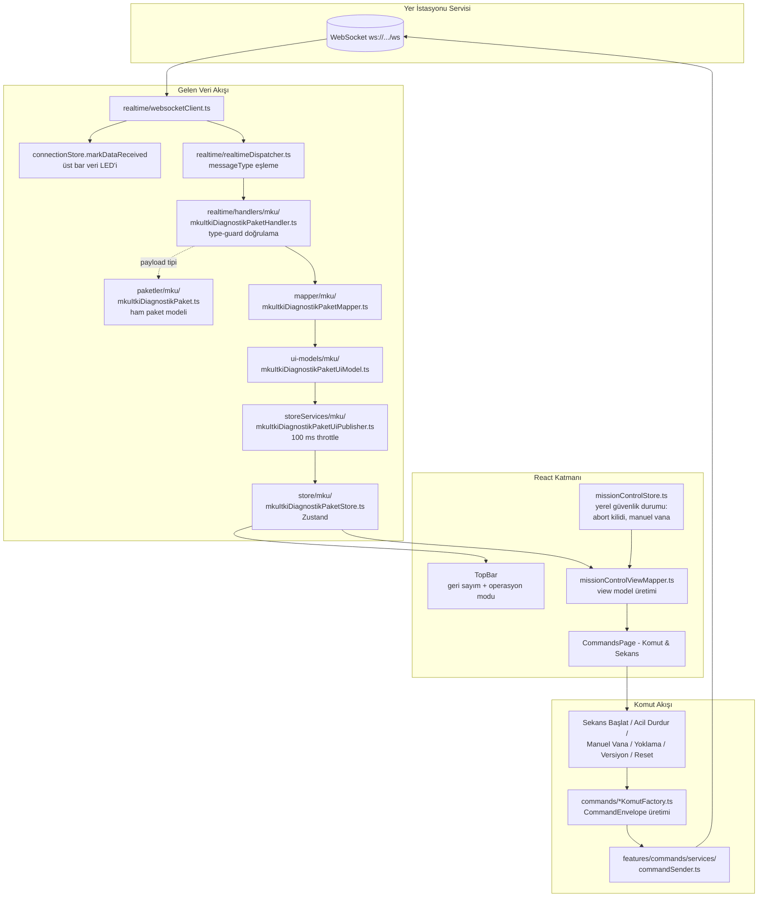

# Rocket Web UI

Rocket Web UI, roket yer istasyonu sistemi için geliştirilen React + TypeScript tabanlı web arayüzüdür.

Bu arayüz WebSocket üzerinden gerçek zamanlı JSON mesajları alır, mesajları `messageType` değerine göre ilgili handler'a yönlendirir, payload verisini uygun paket modeline ayırır, UI modeline dönüştürür ve dashboard/komut & sekans/tablolar/debug ekranlarında gösterir.

Arayüz ayrıca WebSocket üzerinden servise komut mesajları gönderebilir.

## Amaç

Bu projenin amacı:

- Roketten gelen telemetri verilerini gerçek zamanlı göstermek
- WebSocket üzerinden gelen JSON mesajlarını işlemek
- Mesaj tipine göre payload deserialize etmek
- Büyük mesaj modellerini sade UI modellerine dönüştürmek
- Komutları WebSocket üzerinden servise göndermek
- Komutlarda UI üzerinden girilen değerleri payload olarak göndermek
- Geliştirme sırasında ham JSON mesajlarını debug ekranında göstermek
- Modüler, geliştirilebilir ve bakımı kolay bir web arayüzü oluşturmak

## Teknolojiler

- React
- TypeScript
- Vite
- WebSocket
- Zustand
- React Router
- Three.js (ana sayfa 3D roket sahnesi)

## Mimari Kurallar

- Servisler gerçek mesaj modelini yayınlar.
- Web UI kendi UI modelini üretir.
- UI modeller servis tarafına taşınmaz.
- React component içinde WebSocket parse işlemi yapılmaz.
- React component içinde doğrudan mesaj mapping yapılmaz.
- Gelen mesajlar önce `RealtimeMessageEnvelope` olarak parse edilir.
- Mesajlar `messageType` değerine göre dispatcher/handler yapısı ile işlenir.
- Handler'lar payload'u type-guard ile doğrular, mapper ile UI modeline çevirir ve publisher'a verir.
- Publisher'lar store güncellemelerini sabit aralıklarla (throttle) yayınlar; her mesajda render tetiklenmez.
- Komutlar `CommandEnvelope` ile gönderilir.
- Komutlarda `messageType`, komutun ait olduğu paket/model tipini belirtir.
- Komutlarda `commandType`, ilgili paket/model içindeki komutu belirtir.
- Payload isteyen komutlarda değerler UI inputlarından alınır ve payload içerisine yazılır.
- Anlamlı her mimari/özellik değişikliğinde `README.md` güncellenir.

## Veri ve Komut Akış Şeması



## Gelen Mesaj Formatı

Servisten WebSocket üzerinden gelen mesaj formatı:

```json
{
  "id": "1",
  "messageType": "MKUItkiDiagnostikPaket",
  "payload": {}
}
```

TypeScript karşılığı:

```ts
export type RealtimeMessageEnvelope<TPayload = unknown> = {
  id: string;
  messageType: string;
  payload: TPayload;
};
```

Bu yapıda:

- `id`: mesajın geldiği işlemci/route/servis kimliğidir.
- `messageType`: payload modelinin adıdır (`contracts/messageTypes.ts`).
- `payload`: ilgili paket modelinin JSON karşılığıdır.

Tanımlı mesaj tipleri:

```ts
export const MessageTypes = {
  MKUItkiDiagnostikPaket: "MKUItkiDiagnostikPaket",
  MKUYoklamaPaket: "MKUYoklamaPaket",
  MKUVersiyonPaket: "MKUVersiyonPaket",
  MKUResetPaket: "MKUResetPaket",
} as const;
```

## Giden Komut Formatı

Web UI tarafından servise gönderilecek komut formatı:

```json
{
  "id": "1",
  "messageType": "MKUItkiDiagnostikPaket",
  "commandType": "SekansBaslat",
  "payload": {}
}
```

TypeScript karşılığı:

```ts
export type CommandEnvelope<TPayload = unknown> = {
  id: string;
  messageType: string;
  commandType: string;
  payload: TPayload;
};
```

Bu yapıda:

- `id`: komutun hedef/route/işlemci bilgisidir.
- `messageType`: komutun ait olduğu paket/model tipidir.
- `commandType`: ilgili paket/model içindeki komut adıdır.
- `payload`: komuta özel parametrelerdir.

Örneğin arayüzde buton adı `ACİL DURDUR` olabilir, fakat servise gönderilen protokol komutu `commandType: "AcilDurdur"` olur.

Tanımlı komutlar (`src/commands/`):

| Komut klasörü      | commandType    | payload             | Kullanım                                  |
| ------------------ | -------------- | ------------------- | ----------------------------------------- |
| `yoklamaKomut`     | `Yoklama`      | `{}`                | MKU yoklama sorgusu (Tablolar sayfası)    |
| `versiyonKomut`    | `Versiyon`     | `{}`                | MKU versiyon sorgusu (Tablolar sayfası)   |
| `resetKomut`       | `Reset`        | `{}`                | MKU reset (Tablolar sayfası)              |
| `sekansBaslatKomut`| `SekansBaslat` | `{}`                | İtki sekansını başlatır (Komut & Sekans)  |
| `acilDurdurKomut`  | `AcilDurdur`   | `{}`                | Acil durdurma (Komut & Sekans)            |
| `manuelValfKomut`  | `ManuelValf`   | `{ acik: boolean }` | Manuel vana aç/kapat (Komut & Sekans)     |

## Proje Yapısı

```text
src/
 ├── app/
 │   ├── App.tsx                  # route'lar + publisher/websocket yaşam döngüsü
 │   ├── appConfig.ts
 │   └── appVersion.ts
 │
 ├── contracts/                   # gelen/giden JSON zarf tipleri
 │   ├── realtimeMessageEnvelope.ts
 │   ├── commandEnvelope.ts
 │   └── messageTypes.ts
 │
 ├── paketler/                    # servisten gelen HAM paket modelleri
 │   └── mku/
 │       ├── mkuItkiDiagnostikPaket.ts
 │       ├── mkuYoklamaPaket.ts
 │       └── mkuVersiyonPaket.ts
 │
 ├── ui-models/                   # UI'ya özel sadeleştirilmiş modeller
 │   └── mku/
 │
 ├── mapper/                      # paket modeli -> UI modeli dönüşümleri
 │   └── mku/
 │
 ├── store/                       # paket bazlı Zustand store'ları
 │   └── mku/
 │
 ├── storeServices/               # throttle'lı UI publisher'ları (ingest + interval)
 │   └── mku/
 │
 ├── commands/                    # paket/model bazlı komut sabitleri + factory'ler
 │   ├── yoklamaKomut/
 │   ├── versiyonKomut/
 │   ├── resetKomut/
 │   ├── sekansBaslatKomut/
 │   ├── acilDurdurKomut/
 │   └── manuelValfKomut/
 │
 ├── realtime/                    # WebSocket bağlantısı + dispatcher + handler'lar
 │   ├── websocketClient.ts
 │   ├── connectionStore.ts       # bağlantı durumu + dataLive (veri LED'i)
 │   ├── realtimeDispatcher.ts
 │   ├── registerRealtimeHandlers.ts
 │   └── handlers/
 │       └── mku/
 │
 ├── features/
 │   ├── dashboard/               # ana sayfa panelleri (3D sahne, harita, IMU...)
 │   ├── missionControl/          # Komut & Sekans ekranının feature parçaları
 │   │   ├── config/missionControlConfig.ts    # sensör/faz sabitleri
 │   │   ├── engine/colorRamp.ts               # gösterge renk geçişleri
 │   │   ├── store/missionControlStore.ts      # YEREL güvenlik durumu
 │   │   ├── mappers/itkiOpModMapper.ts        # itkiOpDurumlari -> OpMod
 │   │   ├── mappers/missionControlViewMapper.ts
 │   │   ├── components/                       # şema (SVG), grafik, sekans paneli
 │   │   └── missionControl.css
 │   ├── commands/                # genel komut gönderme altyapısı (sender + store)
 │   ├── version/                 # versiyon sorgu feature'ı
 │   ├── switching/               # anahtarlama komutları
 │   └── debug/                   # ham mesaj görüntüleyici
 │
 ├── shared/                      # ortak componentler / tipler / yardımcılar
 │   └── components/              # AppShell, TopBar, PageTabs, Panel, ...
 │
 └── pages/
     ├── DashboardPage.tsx        # /
     ├── GrafikPage.tsx           # /grafik
     ├── TablesPage.tsx           # /tables
     ├── mku/mkuPage.tsx          # /tables/mku
     ├── CommandsPage.tsx         # /commands (Komut & Sekans)
     └── DebugPage.tsx            # /debug
```

## Katman Sorumlulukları

### `src/paketler`

Servisten WebSocket üzerinden gelen ham paket modellerinin TypeScript karşılıkları. Alan adları ve tipleri protokol belgesiyle birebir aynıdır. Ünite bazlı klasörlenir (`mku/`, ileride diğer üniteler).

### `src/ui-models`

Paketlerin arayüzde kullanılacak sadeleştirilmiş karşılıkları. Servis tarafına taşınmaz.

### `src/mapper`

Ham paket modelini UI modeline dönüştüren saf fonksiyonlar.

### `src/store`

Paket bazlı Zustand store'ları. Her store son UI modelini (`ozet`) ve `lastUpdateId` sayacını tutar. Component'ler yalnızca bu store'lara subscribe olur.

### `src/storeServices`

UI publisher'ları: handler'dan gelen son modeli tamponlar (`ingest...ForUi`) ve sabit aralıkla (varsayılan 100 ms) store'a yazar. Böylece yüksek frekanslı telemetri render performansını etkilemez.

### `src/commands`

Paket/model bazlı komut sabitleri (`xKomut.ts`) ve `CommandEnvelope` üreten factory'ler (`xKomutFactory.ts`). Her factory `(id, messageType, ...params)` imzasını kullanır.

### `src/realtime`

WebSocket bağlantısı, otomatik yeniden bağlanma, `messageType` -> handler dispatch yapısı ve paket handler'ları. Handler'lar payload'u type-guard ile doğrular; geçersiz payload konsola uyarı yazar ve akışı bozmaz. `connectionStore` ayrıca üst bardaki veri LED'ini süren `dataLive` bayrağını yönetir (2 sn veri gelmezse söner).

### `src/features/commands`

Genel komut gönderme altyapısı: `commandSender` (WebSocket'e yazma + hata durumu) ve `commandStore` (son komut/durum). Paket özel komut sabitleri burada bulunmaz; `src/commands/` altındadır.

### `src/shared` ve `src/pages`

Ortak görsel bileşenler ve sayfa componentleri. Sayfalar yalnızca feature/shared componentlerini birleştirir; mapping ve WebSocket işlemleri içermez.

## Sayfalar ve Route'lar

```text
/              Ana Sayfa (dashboard: 3D roket, harita, IMU, güç, olay logu)
/grafik        Grafikler
/tables        Model tabloları (MKU sistem bilgisi, yoklama/versiyon/reset)
/commands      Komut & Sekans (itki test standı ekranı)
/debug         WebSocket/debug konsolu
```

## Üst Bar (TopBar)

- **Geri sayım kutusu**: `MKUItkiDiagnostikPaket.itkiBaslatmaGeriSayim_sn` değerini `T- mm:ss` formatında gösterir. Veri yokken `T- --:--`.
- **Operasyon modu kutusu**: `itkiOpDurumlari` değerinin `OpMod` karşılığını gösterir (BEKLEMEDE / GERİ SAYIM / ATEŞLEME / TAMAMLANDI). Veri yokken `MOD BEKLENİYOR`.
- **Veri LED'i**: WebSocket'ten herhangi bir mesaj aktığı sürece yeşil yanar; 2 saniye boyunca hiç mesaj gelmezse kırmızıya döner (`connectionStore.dataLive`).

## Komut & Sekans (İtki Test Standı)

`/commands` sekmesi, itki test standı için Mission Control tarzı HMI/SCADA ekranıdır (`src/features/missionControl`, `src/pages/CommandsPage.tsx`).

Ekran tamamen **gerçek `MKUItkiDiagnostikPaket` telemetrisi** ile beslenir; yerel simülasyon yoktur:

- **Görev fazı**: `itkiOpDurumlari` alanı 4 fazlı sekans listesini sürer. Sayısal kod eşlemesi (0/1/2/3) protokol belgesi netleşene kadar placeholder'dır ve tek noktadan (`mappers/itkiOpModMapper.ts`) güncellenir.
- **Vanalar**: İtki vanası `valfDurum_OksitleyiciValf` alanından okunur (0=KAPALI, diğer=AÇIK placeholder eşlemesi).
- **Ateşleyiciler**: `valfDurum_Igniter1/2` alanlarından okunur (0=GÜVENLİ, 1=KOLLANDI, 2+=ATEŞLENDİ placeholder eşlemesi).
- **Acil durdur durumu**: paketteki `acilDurdurDurum` alanı veya yerel kilit-onaylı buton.
- **Sensör rozetleri (PT/TC)**: Bu paket sensör verisi içermediği için ayrı sensör telemetri paketi tanımlanana kadar eksen alt değerini gösterir (`missionControlViewMapper.ts` içindeki placeholder yardımcıları).

Paneller:

- **P&ID mimik şeması**: oksitleyici tankı (N₂O) → manuel vana → itki vanası → manifold → yanma odası → nozzle; canlı vana/ateşleyici durumları ve sensör rozetleri.
- **Canlı telemetri grafiği**: basınç/sıcaklık serileri.
- **Sekans kontrol paneli**: SEKANS BAŞLAT, kilit + ACİL DURDUR, manuel vana anahtarı, 4 adımlı faz listesi ve RESET.

Komut davranışları:

- `SEKANS BAŞLAT` → `SekansBaslat` komutu gönderilir.
- Kilit butonu ACİL DURDUR'u 10 saniyeliğine aktif eder (buton sabit kırmızı olur); 10 saniye içinde basılmazsa kilit otomatik geri kapanır. Basılırsa `AcilDurdur` komutu gönderilir.
- Manuel vana anahtarı `ManuelValf { acik }` komutunu gönderir ve yerel görsel durumu günceller.

## Ortam Değişkenleri

`.env` dosyası:

```env
VITE_WS_URL=ws://localhost:5000/ws
VITE_TEST_LATITUDE=41.095125
VITE_TEST_LONGITUDE=28.637975
VITE_TEST_ROLL=20
VITE_TEST_PITCH=20
VITE_TEST_YAW=20
VITE_TELEMETRY_UI_PUBLISH_INTERVAL_MS=100
VITE_DEBUG_UI_PUBLISH_INTERVAL_MS=1000
VITE_DEBUG_RAW_MESSAGE_LIMIT=100
VITE_WS_RECONNECT_DELAY_MS=3000
```

- `VITE_WS_URL`: WebSocket bağlantı adresi.
- `VITE_TEST_*`: geliştirme ortamında harita ve yönelim göstergelerini test etmek için kullanılır; canlı telemetri değerleri test değerlerinin önüne geçer.
- `VITE_*_INTERVAL_MS`: publisher yayın aralıkları.
- `VITE_WS_RECONNECT_DELAY_MS`: bağlantı koptuğunda yeniden deneme gecikmesi.

Ortam değişkeni değiştirildikten sonra Vite geliştirme sunucusu yeniden başlatılmalıdır.

## Kurulum ve Çalıştırma

```bash
npm install
npm run dev     # geliştirme
npm run build   # üretim derlemesi
```

## README Güncelleme Kuralı

Aşağıdaki değişikliklerde `README.md` güncellenmelidir:

- Yeni modül/paket eklenirse
- Proje klasör yapısı değişirse
- WebSocket mesaj formatı değişirse
- `CommandEnvelope` formatı veya komut listesi değişirse
- Komut anlamlandırma kuralı değişirse
- Yeni ortam değişkeni eklenirse
- Kurulum/çalıştırma adımları değişirse
- Yeni ana özellik eklenirse
- Mimari karar değişirse

Sadece küçük görsel/CSS değişikliklerinde README güncellemek zorunlu değildir.
